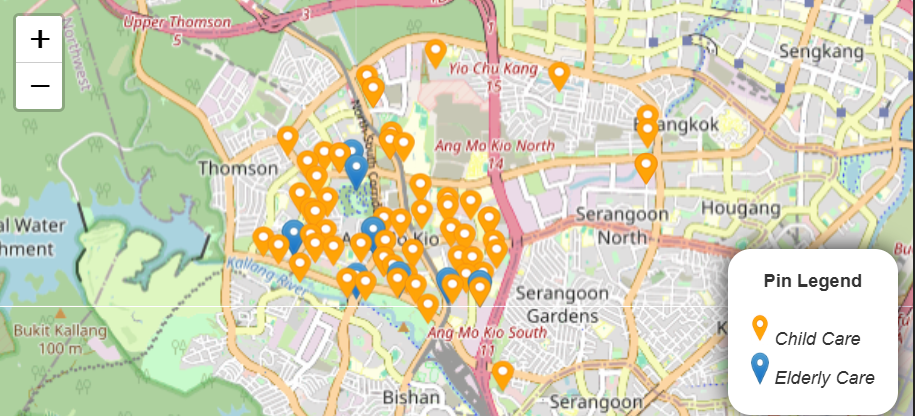

# Setup
Important Note: To be use together with sg_property_datapipeline project

#### Installing node packages
a. Using repo package.json
```
npm install
```

b. Using fresh vite@latest package.json
```
npm install
npm install express mysql2 cors axios dotenv
npm install chart.js react-chartjs-2
npm install react-leaflet leaflet leaflet.heat
npm install react-tabs
```

#### Preparing .env file
Creating .env in root folder with the following fields

IMPORTANT: There must be "VITE_" prefix in the names
```
VITE_DB_HOST = <to_fill_in_database_url>
VITE_DB_USER = <to_fill_in_database_username>
VITE_DB_PASSWORD = <to_fill_in_database_password>
VITE_DB_NAME = <to_fill_in_database_name>
VITE_PORT = <to_fill_in_database_port>
```

# Usage
#### Running server
To read from MySQL database and serves API request
```
node ./scripts/server.js
```

#### Running the react client
```
npm run dev
```

# Feature Log
1. Added Resale price data feature viewable by Year & Town 

   
   
   

2. Added Rental price data feature viewable by Year & Town 

3. Added Transport (Carpark) viewable by Town's category or radius from Town's centre

   

4. Added Transport (Bus Stop) viewable by radius from Town's centre only

5. Added Child/Elderly Care viewable by Town's category or radius from Town's centre

   

6. Added Hawker Centre and Healthier Eateries viewable by Town's category or radius from Town's centre

   