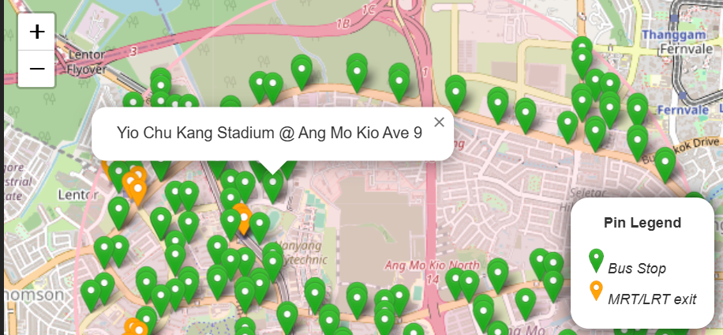

# Setup
Important Note: To be use together with sg_property_datapipeline project

#### Installing node packages
a. Using repo package.json
```
npm install
```

b. Using fresh vite@latest package.json
```
npm install
npm install express mysql2 cors axios dotenv
npm install chart.js react-chartjs-2
npm install react-leaflet leaflet leaflet.heat
npm install react-tabs
```

#### Preparing .env file
Creating .env in root folder with the following fields

IMPORTANT: There must be "VITE_" prefix in the names
```
VITE_DB_HOST = <to_fill_in_database_url>
VITE_DB_USER = <to_fill_in_database_username>
VITE_DB_PASSWORD = <to_fill_in_database_password>
VITE_DB_NAME = <to_fill_in_database_name>
VITE_PORT = <to_fill_in_database_port>
```

# Usage
#### Running server
To read from MySQL database and serves API request
```
node ./scripts/server.js
```

#### Running the react client
```
npm run dev
```

# Feature Log
1. Added Property (Resale price) data feature viewable by Year & Town 

   
   
   

2. Added Property (Rental price) data feature viewable by Year & Town 

3. Added Transport (Carpark) viewable by radius from Town's centre only

   

4. Added Transport (Bus Stop & MRT/LRT) viewable by radius from Town's centre only

   

5. Added Lifecare Services (Child/Elderly Care & Disability Services) viewable by Town's category or radius from Town's centre

   

6. Added Healthcare Services (Chas Clinic) viewable by radius from Town's centre only

7. Added Food Services (Hawker Centre and Healthier Eateries) viewable by Town's category or radius from Town's centre

   

8. Added Retail Services (Supermarket) viewable by radius from Town's centre only