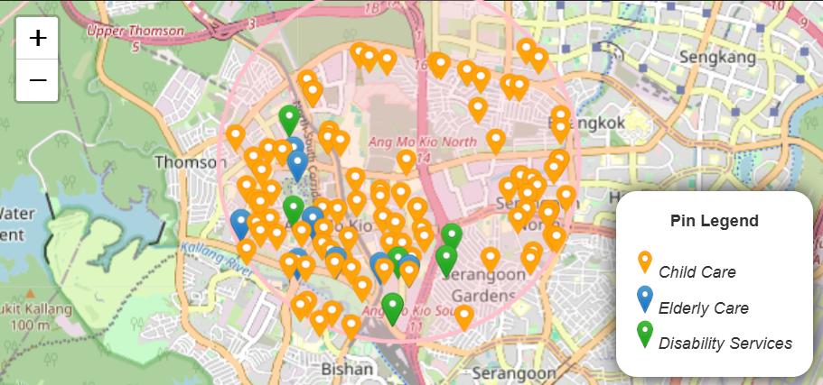

# Introduction
The original intention was to have a high level view of price of the singapore HDB property market. Main goal was to provide additional information to aid in the decision of buying HDB property or town planning. Including private property was possible but not a priority (not in the foreseeable future). Currently, HDB BTO data are not easily available (only 3rd party website or stats published in PDF), will including HDB BTO data when it is more assessible.

At later stages, it scaled to provide a better view of supporting infrastructure and amenities around the property (or town). 
- Carpark (Seasonal/Short Term Parking, FOC/non-FOC) 
- Public Transport (Bus stop & MRT/LRT)
- Lifecare (Child/Elderly Care & Disability Services)
- Healthcare (Chas Clinic)
- Food (Hawker & Eateries)
- Retail (Supermarket)

Planning area from onemap api (polygon map) is included to replace the original postal code method when selecting by town's category. The planning area data is retrieve from the database, where in the sg_property_datapipeline project download the polygon map using download_planning_area script.

Finally, this project is free for usage, however it should not be commericalize for any use of profit.

# Implementation
For <u>Servers</u>, there is a database script. It is responsible for retrieving raw data (for client processing) or backend processed data from the SQL database

For <u>Map Components</u>, there are two types of implementation: client processing vs backend processing. 

1. Client processing
   - Pro: Easier update on the React side if there is a change in the format of the GeoJson.
   - Con: Heavier processing each time different selection is made.

2. Backend processing
   - Pro: Less processing and quicker response each time different selection is made.
   - Con: Requires update or running of sg_property_datapipeline in order to take effect.

Remarks: This project serves to illustrate the different implementation. By no means, it is a production ready code.

# Setup
#### 1. Database
To be use together with sg_property_datapipeline project

- sg_property_datapipeline project populate the database 
- running of DataServer script to retrieve from database

#### 2. Installing node packages
a. Using repo package.json
```
npm install
```

b. Using fresh vite@latest package.json
```
npm install
npm install express mysql2 cors axios dotenv
npm install sharp
npm install chart.js react-chartjs-2
npm install react-leaflet leaflet leaflet.heat
npm install react-tabs
```

#### 3. Preparing .env file
Creating .env in root folder with the following fields

IMPORTANT: There must be "VITE_" prefix in the names
```
VITE_DB_HOST = <to_fill_in_database_url>
VITE_DB_USER = <to_fill_in_database_username>
VITE_DB_PASSWORD = <to_fill_in_database_password>
VITE_DB_NAME = <to_fill_in_database_name>
VITE_DB_PORT = <to_fill_in_database_port>
```

# Usage
#### Running server
To read from MySQL database and serves API request
```
node ./scripts/DataServer.js
```

#### Running the react client
```
npm run dev
```

# Features Log
1. Added Property (Resale price) data feature viewable by Year & Town 

   
   
   

2. Added Property (Rental price) data feature viewable by Year & Town 

3. Added Transport (Carpark) viewable by radius from Town's centre only

   

4. Added Transport (Bus Stop & MRT/LRT) viewable by radius from Town's centre only

   

5. Added Lifecare Services (Child/Elderly Care & Disability Services) viewable by Town's category or radius from Town's centre

   

6. Added Healthcare Services (Chas Clinic) viewable by Town's category or radius from Town's centre

   

7. Added Food Services (Hawker Centre and Healthier Eateries) viewable by Town's category or radius from Town's centre

   

8. Added Retail Services (Supermarket) viewable by Town's category or radius from Town's centre

   

9. Rework the viewable by Town's category using planning area instead of postal code and added all sub-category with viewable by Town's category

10. Added planning area under resources tab.