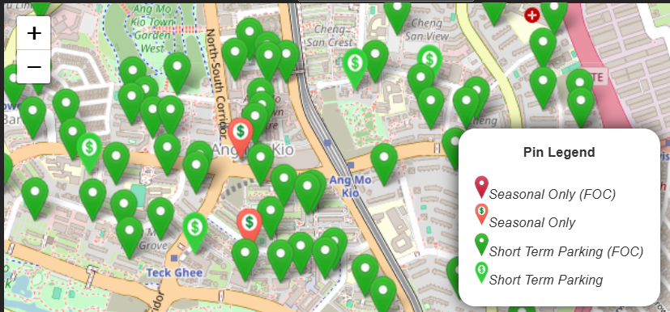

# Introduction
The original intention was to have a high level view of price of the singapore HDB property market. Main goal was to provide additional information to aid in the decision of buying HDB property or town planning. Including private property was possible but not a priority (not in the foreseeable future). 

At later stages, it scaled to provide a better view of supporting infrastructure and amenities around the property (or town).

Open Weather API was also discovered to have mapping capabilities, hence integrated as part of the viewer. Although it is world-based data and probably not very suitable for Singapore use-case, but it illustrates the usefulness if there is an weather API that have granular data for Singapore use-case. 

Finally, this project is free for usage, however it should not be commericalize for any use of profit.

# Implementation
For <u>Servers</u>, there are two types: the database server, and the map tile server

1. Database server: To retrieve raw data (for client processing) or backend processed data from the SQL database

2. Map Tile server: To encapsulate the api key away from the client, as well as enhancing the images retrieve from the Open Weather Server

For <u>Map Components</u>, there are two types of implementation: client processing vs backend processing. 

1. Client processing
   - Pro: Easier update on the React side if there is a change in the format of the GeoJson.
   - Con: Heavier processing each time different selection is made.

2. Backend processing
   - Pro: Less processing and quicker response each time different selection is made.
   - Con: Requires update or running of sg_property_datapipeline in order to take effect.

Remarks: This project serves to illustrate the different implementation. By no means, it is a production ready code.

# Setup
Important Note: To be use together with sg_property_datapipeline project. 

#### Installing node packages
a. Using repo package.json
```
npm install
```

b. Using fresh vite@latest package.json
```
npm install
npm install express mysql2 cors axios dotenv
npm install sharp
npm install chart.js react-chartjs-2
npm install react-leaflet leaflet leaflet.heat
npm install react-tabs
```

#### Preparing .env file
Creating .env in root folder with the following fields

IMPORTANT: There must be "VITE_" prefix in the names
```
VITE_DB_HOST = <to_fill_in_database_url>
VITE_DB_USER = <to_fill_in_database_username>
VITE_DB_PASSWORD = <to_fill_in_database_password>
VITE_DB_NAME = <to_fill_in_database_name>
VITE_DB_PORT = <to_fill_in_database_port>

VITE_OPEN_WEATHER_API = <register_openweathermap_api_key_and_fill_in>
VITE_TILE_HOST = <to_fill_in_database_url>
VITE_TILE_PORT = <to_fill_in_tile_port>
```

# Usage
#### Running server
To read from MySQL database and serves API request
```
node ./scripts/DataServer.js
```

#### Running the react client
```
npm run dev
```

# Features Log
1. Added Property (Resale price) data feature viewable by Year & Town 

   
   
   

2. Added Property (Rental price) data feature viewable by Year & Town 

3. Added Transport (Carpark) viewable by radius from Town's centre only

   

4. Added Transport (Bus Stop & MRT/LRT) viewable by radius from Town's centre only

   

5. Added Lifecare Services (Child/Elderly Care & Disability Services) viewable by Town's category or radius from Town's centre

   

6. Added Healthcare Services (Chas Clinic) viewable by radius from Town's centre only

7. Added Food Services (Hawker Centre and Healthier Eateries) viewable by Town's category or radius from Town's centre

   

8. Added Retail Services (Supermarket) viewable by radius from Town's centre only

9. Added Weather Map viewable by region's point of view

   <u>Cloud Map</u>
   

   <u>Precipitation Map</u>
   

   <u>Temperature Map</u>
   

   <u>Wind Speed Map</u>
   